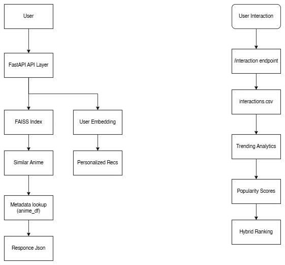

# Anime Recommendation System (Vector Search + FastAPI)

A scalable anime recommendation system that combines **embedding-based similarity**, **FAISS vector search**, and a **FastAPI inference service**.

The system generates anime and user embeddings from interaction data and serves real-time recommendations via a lightweight API.

This project demonstrates the full ML system pipeline:

- data ingestion
- preprocessing
- embedding generation
- vector indexing
- recommendation retrieval
- API serving
- system evaluation


---

# System Architecture



Pipeline overview:

1. **Raw Data**
   - Anime metadata
   - User–anime interaction data

2. **Data Pipeline**
   - Cleaning and preprocessing
   - User–item interaction matrix creation

3. **Embedding Model**
   - Matrix factorization generates latent vectors for:
     - users
     - anime

4. **Vector Store**
   - Anime embeddings indexed with **FAISS**
   - Enables fast similarity search

5. **API Layer**
   - FastAPI serves recommendation endpoints
   - Handles:
     - similar anime queries
     - personalized recommendations
     - interaction logging
     - trending detection


---
## Installation

### Runtime (API server)

```bash
pip install -r requirements.txt

### Development/ Training
```bash
pip install -r requirements-dev.txt

---
# Features

## Content Similarity

Find anime similar to a given title using embedding distance.

Endpoint:

```
GET /similar/{anime_id}
```

Returns the most similar anime using FAISS nearest-neighbor search.


---

## Personalized Recommendations

```
GET /recommend/{user_index}
```

Recommendations based on user embedding proximity in vector space.

System also filters:

- previously watched anime
- invalid items
- missing metadata


---

## Interaction Tracking

```
POST /interaction
```

Logs user activity such as:

- watch
- click
- view

Used for:

- recommendation filtering
- trending analytics
- future model retraining


---

## Trending Detection

```
GET /trending
```

Calculates trending anime based on recent interaction activity.


---

# Performance

Vector search latency using **FAISS**.

| Metric | Value |
|------|------|
| Anime indexed | ~6,000 |
| Embedding dimension | 64 |
| Top-10 retrieval latency | ~1 ms |
| Index type | FAISS FlatL2 |


---

# Dataset Statistics

| Metric | Value |
|------|------|
| Anime | 6,143 |
| Users | 73,516 |
| Interaction records | ~7M |
| Embedding dimension | 64 |

Dataset source:

Anime Recommendations Database  
https://www.kaggle.com/datasets/CooperUnion/anime-recommendations-database

Datasets are not included in the repository due to GitHub file size limits.

Place downloaded data in:

```
data/raw/
```


---

# Project Structure

```
anime_recommendation_system/
│
├── api/
│   └── main.py                # FastAPI service
│
├── data_pipeline/
│   ├── ingest.py
│   ├── preprocess.py
│   ├── preprocess_interactions.py
│   └── build_matrix.py
│
├── models/
│   └── train_model.py         # embedding model training
│
├── vector_store/
│   ├── build_index.py
│   └── query_index.py
│
├── evaluation/
│   ├── benchmark.py
│   └── system_stats.py
│
├── docs/
│   └── architecture.png
│
└── README.md
```


---

# Running the API

Install dependencies:

```
pip install -r requirements.txt
```

Run the API:

```
uvicorn api.main:app --reload
```

Open the interactive documentation:

```
http://127.0.0.1:8000/docs
```


---

# Example API Usage

Get similar anime

```
GET /similar/100
```

Example response:

```json
{
  "query_anime": 100,
  "recommendations": [
    {
      "anime_id": 104,
      "title": "Ayashi no Ceres",
      "score": 7.34
    }
  ]
}
```


---

# Evaluation

Benchmark utilities measure:

- vector search latency
- embedding statistics
- dataset coverage

Scripts:

```
evaluation/benchmark.py
evaluation/system_stats.py
```


---

# Future Improvements

- hybrid recommendation model (content + collaborative filtering)
- approximate FAISS indexing (IVF / HNSW)
- online retraining pipeline
- real-time interaction streaming
- containerized deployment (Docker)
